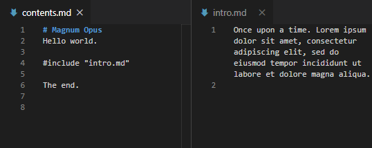

# rift (Recursively Include Text Files)
This little program recursively replaces include statements in text files with the contents of that file. It was written as a Markdown helper but is completely format-agnostic.



The inclusions are done in the current **working directory**. The exact same file and directory structure is being written to an output directory of your choice, which must be specified with `--out_path`. Example use:

```
path\to\rift.exe --out_path=result
```

By default, the regular expression for the include statements is `#include \"([\w.\/%]*)\"`, which understands something like `#include "subdir/file.md"`. This can be overwritten with the `--regex` parameter. This must be a regex with a capture group for the actual filename.

```
    --regex="#include \"([\w.\/%]*)\""
```

The includes happen recursively, so it'll happily try to resolve two files including each other. To put and end to such sillyness, there is a maximum inclusion depth. Its default is `5`, but you can overwrite it with `--max_depth n`.

The files that are being processed can be filtered by their extension. The parameter `--ext=md,txt` sets a comma separated list of valid extensions. All files that don't match get ignored and are neither valid sources nor targets of inclusion. They also don't get copied over to the output directory. By default this filter is empty, meaning no filtering is done.

rift does not understand *any* format specifics so you can't comment out the include commands.


## Technicalities
This code can be considered public domain. The only library used is a slightly modified [CLI11](https://github.com/CLIUtils/CLI11). Windows binaries are included.

This does require C++20 if you want to compile yourself (for `std::map::contains()`).
